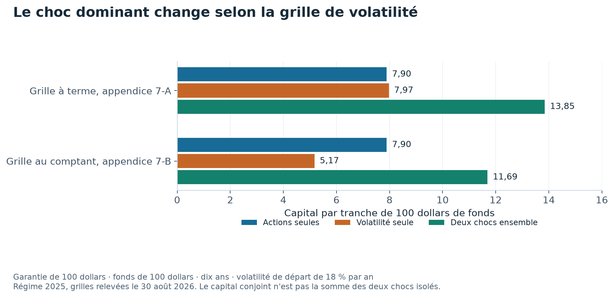

# Que coûte à un assureur la promesse de protéger un placement ?

Supposons qu'un assureur garantisse 100 dollars à l'échéance d'un placement. Si le fonds ne vaut plus que 80 dollars ce jour-là, il doit payer les 20 dollars manquants.

Cette promesse devient plus coûteuse quand les actions baissent. Elle peut aussi coûter davantage quand leurs mouvements futurs deviennent plus incertains, même sans baisse immédiate.

Ce projet refait les calculs réglementaires canadiens de cette garantie simple. Il sépare le choc sur les actions du choc sur leur volatilité, c'est-à-dire l'ampleur attendue de leurs variations.

**Les deux chocs comptent. Celui qui domine dépend de la grille réglementaire utilisée.**

## Comparer les chocs sur le même contrat

L'exemple suivant porte sur un fonds de 100 dollars, une garantie de 100 dollars et une échéance de dix ans. La volatilité de départ est fixée à 18 % par an.



Chaque groupe applique une des deux grilles publiées par le BSIF, le régulateur financier fédéral canadien. La barre du scénario conjoint montre pourquoi additionner les deux chocs isolés ne donne pas le bon total.

| Grille de volatilité | Actions seules | Volatilité seule | Deux chocs ensemble |
|---|---:|---:|---:|
| À terme, appendice 7-A | 7,90 $ | 7,97 $ | 13,85 $ |
| Au comptant, appendice 7-B | 7,90 $ | 5,17 $ | 11,69 $ |

Les montants sont par tranche de 100 dollars de fonds. Les deux grilles décrivent différemment la volatilité selon l'échéance. Leur choix change le classement des chocs. [Décomposition complète](results/tables/decomposition.csv).

## Contrôler la lecture du règlement

Le programme utilise les tableaux figés du régime 2025, relevés le 30 août 2026. Il retrouve les neuf chocs des exemples officiels.

Un total imprimé ne correspond pas à ses propres entrées. Le document donne 51,4 alors que 54,0 moins 3,6 fait 50,4. Le dépôt présente les deux nombres et le calcul intermédiaire.

D'autres exercices font varier la durée de la garantie et rejouent une couverture sur les vingt trajectoires imposées par le régulateur.

## Ce qui reste hors du modèle

La garantie étudiée est payable à une échéance fixe. Les retraits garantis à vie, les revalorisations de garantie et la réassurance ne sont pas modélisés.

Les chiffres représentent une composante du capital de risque de marché. Ils ne donnent ni le prix commercial du contrat ni le capital total d'un assureur.

## Refaire les calculs

```bash
uv sync --locked --all-extras
uv run pytest
uv run fdg tout
```

Aucun téléchargement n'est nécessaire. Les grilles réglementaires utilisées sont conservées dans le paquet. Le graphique de présentation se régénère hors réseau avec `uv run python scripts/figure_presentation.py`, depuis les tableaux publiés.

## Pour aller plus loin

[Méthodes, résultats complets et références](docs/ETUDE_DETAILLEE.md) · [Présentation en PDF](rapport/rapport.pdf) · [Citer le projet](CITATION.cff) · [Licence](LICENSE).

## English summary

A simple segregated fund maturity guarantee is valued under Canada's published equity and volatility stresses. The ranking of the two shocks changes between the forward and spot grids. The calculation covers a market risk component, not an insurer's full capital requirement.
