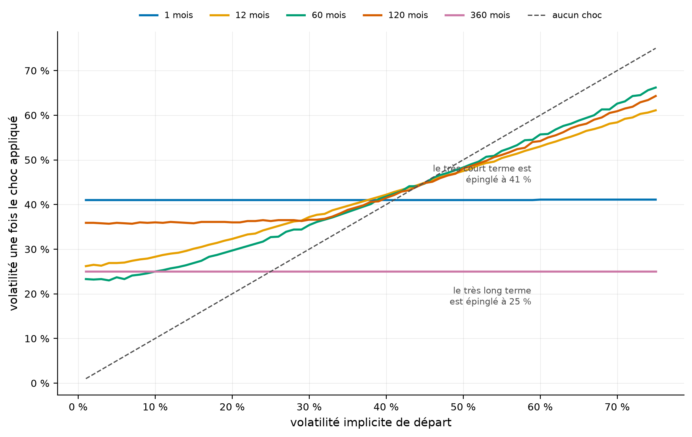
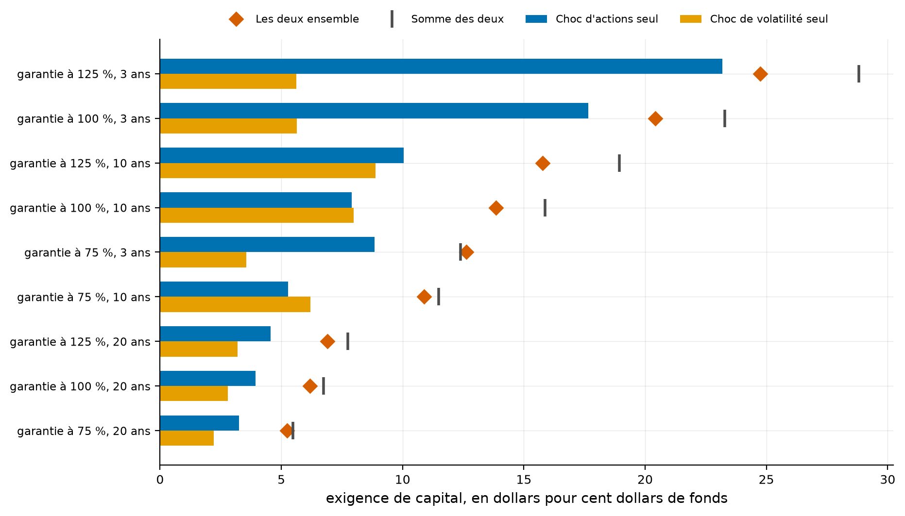
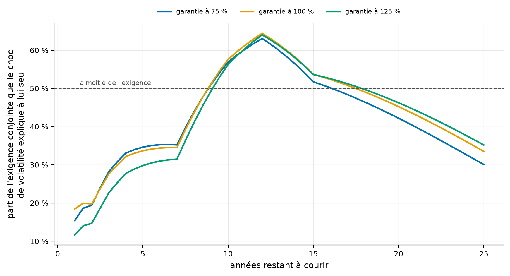
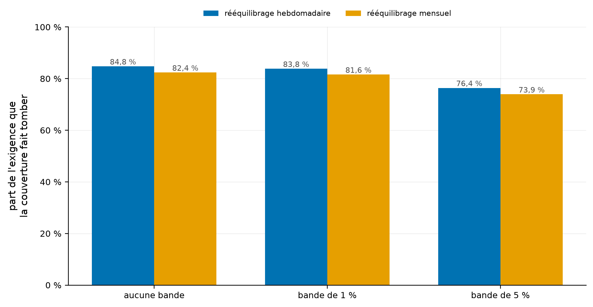
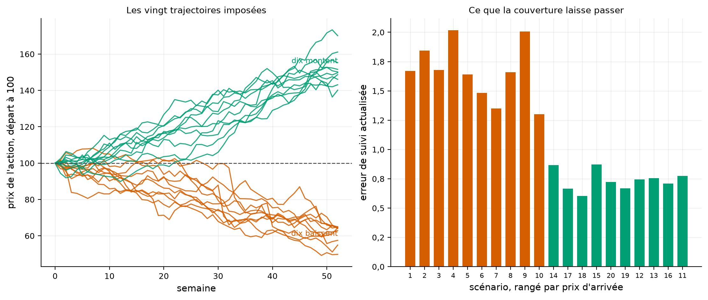

# Le choc de volatilité pèse plus lourd que le choc d'actions, et personne ne l'a écrit

Depuis 2025, le BSIF exige des assureurs vie qu'ils calculent le capital de leurs garanties de fonds
distincts en faisant baisser les actions et monter la volatilité en même temps. La partie
volatilité est la nouveauté, et elle est publiée sous forme d'une grille de mille nombres sans un mot
sur ce qu'elle fait. Ce dépôt la refait, mesure ce qu'elle coûte, et trouve une erreur dans les
exemples du régulateur.

[](https://github.com/Guilou001/31-fonds-distincts/actions/workflows/ci.yml)


**Résultat en une phrase.** Sur une garantie de dix ans à cent pour cent, le choc de volatilité exige
à lui seul **7,97 dollars** de capital par cent dollars de fonds. Le choc d'actions en exige
**7,90**, si bien que la volatilité fait **57,6 %** de l'exigence conjointe. Les neuf exemples
travaillés de la ligne directrice se reproduisent tous, sauf une addition : elle imprime **51,4** là
où 54,0 moins 3,6 fait **50,4**. Ce classement vaut sous l'appendice 7-A, la grille à terme, et
s'inverse sous l'appendice 7-B, la grille au comptant, que le § 5.3 mesure aussi.

*Summary in English. OSFI's 2025 segregated fund guarantee regime requires insurers to shock equity
levels and implied volatilities simultaneously. This repository rebuilds the volatility shock grid of
Appendix 7-A (75 × 13 published values), reproduces all nine of the guideline's worked interpolation
examples and finds that one of the nine printed totals does not add up (51.4 where 54.0 − 3.6 = 50.4).
It then measures what nobody publishes: across the sample contracts the volatility shock alone
accounts for 22.7 % to 57.6 % of the joint market risk requirement, a share that moves with both
term and moneyness; on a continuous grid of terms it peaks at 64.4 % around twelve years. The two
shocks interfere rather than add. That ranking of the two shocks is specific to Appendix 7-A:
under Appendix 7-B,
the spot-based grid, the volatility share of the ten-year contract falls to 44.2 % and equity leads
again. The grid turns out to pin one-month volatility at 41 % whatever the insurer's starting level,
and Appendix 7-A also pins thirty-year volatility at 25 %, so an insurer above roughly 45 % sees its
volatility reduced by the stress. Replaying a delta hedge over the twenty prescribed scenarios of
Appendix 7-C removes 84.8 % of the equity risk requirement, and all twenty scenarios lose money.
Over half of what is left is a deterministic drift that a flat price path already produces, and the
repository publishes that floor beside the headline.*

## 1. La question posée

**Le produit, en mots simples.** Un fonds distinct est un fonds commun de placement vendu par un
assureur, avec une promesse en plus. Quelle que soit la valeur du fonds à l'échéance, le détenteur
récupère au moins un montant garanti. L'assureur prélève des frais annuels et, en échange, comble la
différence si le fonds a baissé.

**Ce que l'assureur a vendu.** Exactement une option de vente. Si le fonds finit au-dessus de la
garantie, l'assureur ne paie rien ; sinon, il paie la différence. C'est pourquoi une hausse de
volatilité lui coûte cher alors même que le niveau du marché n'a pas bougé.

**Ce que le régulateur a changé.** L'ancien régime chargeait le capital par des facteurs tabulés. Le
nouveau demande de réévaluer le passif sous un scénario de tension, et ce scénario comporte deux
chocs simultanés : les actions baissent de 35 %, et la volatilité implicite bouge selon une grille
publiée en appendice. La question est de savoir lequel des deux fait le capital.

## 2. D'où vient le projet, et ce qu'il apporte

La ligne directrice publie tout ce qu'il faut. Elle donne la grille des chocs, neuf exemples
travaillés de son interpolation, vingt trajectoires de prix imposées pour juger une couverture, et un
exemple chiffré de la mécanique de couverture. Aucun dépôt public ne la calcule.

Trois apports.

- **Les neuf exemples travaillés refaits**, dont huit se referment et un non.
- **La structure cachée de la grille**, qui n'est pas une table de chocs mais une table qui épingle
  les deux bouts de la courbe de volatilité et laisse le milieu suivre l'assureur.
- **Le partage de l'exigence** entre le choc d'actions et le choc de volatilité, mesuré selon
  l'échéance et selon la monnaie, le rapport de la garantie au fonds. S'y ajoute le crédit qu'une
  couverture dynamique fait gagner sur les vingt scénarios du régulateur.

## 3. Les données

Aucun téléchargement récurrent : tout vient de la ligne directrice elle-même.

| Source | Ce qu'elle donne | Volume |
|---|---|---:|
| Appendice 7-A | le choc de volatilité sur une base à terme | 75 × 13 valeurs |
| Appendice 7-B | le même sur une base au comptant | 75 × 13 valeurs |
| Appendice 7-C | vingt trajectoires de prix d'actions sur un an | 53 points hebdomadaires et 13 mensuels |
| Section 7.2.2 | neuf exemples travaillés d'interpolation | 9 lignes |
| Section 7.3.2.3 | un exemple chiffré de la mécanique de couverture | 9 lignes |
| Section 5.2.1 | le facteur de choc des actions, 35 % | 1 valeur |

Les 3 270 nombres sont relevés le 30 août 2026 et figés dans `src/fdg/tables/`. Ils ne sont pas
retéléchargés à chaque exécution. La page du BSIF les publie en HTML, dans des tableaux dont la mise
en forme change d'une version à l'autre, et un chargeur automatique casserait au premier changement
de gabarit, sans le dire. Ce qui change avec la ligne directrice se change à la main, une fois.

## 4. La méthode, pas à pas

1. **Recopier les trois appendices**, puis vérifier qu'ils ont été lus dans le bon sens. Les vingt
   cellules que les exemples citent nommément doivent se retrouver, et les tables hebdomadaire et
   mensuelle de l'appendice 7-C doivent finir au même point.
2. **Écrire l'interpolation bilinéaire**, le calcul qui donne le choc d'un assureur qui ne tombe sur
   aucune case de la grille, ni en volatilité ni en échéance, puis la confronter aux neuf exemples
   travaillés.
3. **Évaluer la garantie** sous la mesure neutre au risque que le chapitre impose, par la formule
   fermée de Black et Scholes et par simulation, et exiger qu'elles se rejoignent.
4. **Appliquer les chocs**, séparément puis ensemble, et mesurer ce que chacun apporte.
5. **Rejouer la couverture** sur les vingt trajectoires imposées, semaine après semaine.

## 5. Les résultats

### 5.1 Neuf chocs sur neuf, huit totaux sur neuf

La ligne directrice déroule neuf calculs, trois volatilités de départ par trois échéances, avec
l'arithmétique écrite en toutes lettres.

| Volatilité de départ | Mois | Choc publié | Choc recalculé | Total publié | Total recalculé |
|---:|---:|---:|---:|---:|---:|
| 5,0 % | 1 | +36,0 | +36,000 | 41,0 | 41,0 |
| 5,0 % | 115 | +29,1 | +29,136 | 34,1 | 34,1 |
| 5,0 % | 550 | +20,0 | +20,000 | 25,0 | 25,0 |
| 18,7 % | 1 | +22,3 | +22,300 | 41,0 | 41,0 |
| 18,7 % | 115 | +16,2 | +16,246 | 34,9 | 34,9 |
| 18,7 % | 550 | +6,3 | +6,300 | 25,0 | 25,0 |
| 54,0 % | 1 | −13,0 | −13,000 | 41,0 | 41,0 |
| **54,0 %** | **115** | **−3,6** | **−3,581** | **51,4** | **50,4** |
| 54,0 % | 550 | −29,0 | −29,000 | 25,0 | 25,0 |

Comment lire ce tableau, en trois constats. Le premier est que les neuf chocs se retrouvent, à la
décimale que la ligne directrice imprime : l'interpolation est comprise et la grille est lue dans le
bon sens. Les vingt cellules citées nommément dans les exemples le confirment aussi. Le deuxième
est que la huitième ligne ne se referme pas : le choc est juste, mais l'addition ne l'est pas, car
54,0 moins 3,6 fait 50,4 et non 51,4. Le troisième est que ce n'est pas une convention d'arrondi :
les deux lignes qui l'encadrent dans le même tableau, 54,0 moins 13,0 égale 41,0 et 54,0 moins 29,0
égale 25,0, tombent toutes les deux juste. Ce que le tableau n'établit pas : rien ici ne dit si
l'erreur est dans l'imprimé ou dans le calcul du régulateur, et le dépôt ne le sait pas.

Constat mesuré le 30 août 2026 sur la version 2025 de la ligne directrice.

### 5.2 La grille n'est pas une table de chocs, c'est une table de cibles aux deux bouts

Appendice 7-A, base à terme. Le fichier `results/tables/structure_de_la_grille.csv` porte les
vingt-six lignes des deux appendices.

| Échéance | Volatilité choquée la plus basse | La plus haute | Étendue |
|---:|---:|---:|---:|
| 1 mois | 41,0 % | 41,1 % | **0,1** |
| 24 mois | 21,5 % | 67,5 % | 46,0 |
| 120 mois | 35,7 % | 64,3 % | 28,6 |
| 360 mois | 25,0 % | 25,0 % | **0,0** |
| 1200 mois | 25,0 % | 25,0 % | **0,0** |

Comment lire ce tableau, en trois constats. Le premier est qu'à un mois, les soixante-quinze niveaux
de volatilité de départ arrivent tous à **41 %** : un assureur à 5 % reçoit +36, un assureur à 54 %
reçoit −13, et les deux finissent au même endroit. Le deuxième est qu'à trente et à cent ans, ils
arrivent tous à **25 %**, cette fois exactement. Le troisième est qu'entre les deux, l'étendue
s'ouvre jusqu'à quarante-six points : au milieu de la courbe, le régulateur impose un déplacement et
non un niveau. La ligne directrice ne l'écrit nulle part. Ce que le tableau n'établit pas : il ne
dit pas pourquoi le régulateur a choisi ces deux cibles, et il ne vaut que pour l'appendice lu.

L'épinglage du très court terme se retrouve dans les deux appendices, à 0,1 point d'étendue près.
Celui du très long terme est propre à l'appendice 7-A. Sur l'appendice 7-B, la colonne de 360 mois
laisse **23,7** points d'étendue, de 28,1 à 51,8 %, et celle de 1 200 mois en laisse **9,2**.

La conséquence pratique se lit sur le pivot, le niveau de volatilité au-delà duquel le choc devient
une baisse. Sur l'appendice 7-A, il vaut **25,0 %** aux très longues échéances, **51,4 %** à quinze
ans, et **44,7 %** en médiane sur les treize colonnes. Autrement dit, un assureur dont la volatilité
implicite dépasse la mi-quarantaine voit sa volatilité réduite par le scénario de tension.



Comment lire cette figure : l'abscisse est la volatilité de départ, l'ordonnée celle qui sort du
choc, et la diagonale marque l'absence de choc. Les cinq courbes tracées portent les échéances de
1, 12, 60, 120 et 360 mois, qui ne sont pas les cinq du tableau ci-dessus. Une courbe horizontale
signifie que le régulateur impose un niveau. Quatre des cinq courbes coupent la diagonale entre
41,0 et 44,8 %, et celle de 360 mois la coupe à 25,0 %. À gauche du croisement le choc monte, à droite il descend.

### 5.3 Le choc de volatilité dépasse le choc d'actions de dix à quatorze ans, à cent pour cent de garantie

Exigence de capital, en dollars pour cent dollars de fonds, sur une volatilité de départ de 18 %, le
choc de volatilité étant lu dans l'appendice 7-A.

| Contrat | Choc d'actions seul | Choc de volatilité seul | Les deux ensemble | Somme des deux | Part de la volatilité |
|---|---:|---:|---:|---:|---:|
| garantie à 75 %, 3 ans | 8,84 | 3,56 | 12,62 | 12,40 | 28,2 % |
| garantie à 75 %, 10 ans | 5,29 | 6,20 | 10,89 | 11,48 | 56,9 % |
| garantie à 100 %, 3 ans | 17,66 | 5,63 | 20,42 | 23,29 | 27,6 % |
| **garantie à 100 %, 10 ans** | **7,90** | **7,97** | **13,85** | **15,87** | **57,6 %** |
| garantie à 100 %, 20 ans | 3,95 | 2,80 | 6,19 | 6,75 | 45,2 % |
| garantie à 125 %, 3 ans | 23,19 | 5,61 | 24,75 | 28,80 | 22,7 % |
| garantie à 125 %, 10 ans | 10,05 | 8,88 | 15,78 | 18,93 | 56,3 % |

Comment lire ce tableau, en trois constats. Le premier est qu'à dix ans, le choc de volatilité exige
plus que le choc d'actions pour les garanties à 75 % et à 100 %, le résultat de tête du dépôt ; à
125 % le choc d'actions garde 1,17 dollar d'avance. Le deuxième est que les deux chocs ne
s'additionnent pas : l'exigence conjointe est plus petite que leur somme, de 2,0 dollars sur le
contrat type et jusqu'à 4,1 sur la garantie à 125 % à trois ans. Le mécanisme est simple : la
baisse des actions pousse la garantie dans la monnaie, et une option très dans la monnaie perd sa
sensibilité à la volatilité. Le troisième est
qu'il existe une exception, la garantie à 75 % à trois ans, où les deux chocs se renforcent de
0,23. Cette garantie est si loin de la monnaie que la baisse des actions l'en rapproche au lieu de
l'y enfoncer, et l'amène là où la volatilité compte le plus. Ce que le tableau n'établit pas : il
porte sur un contrat à la fois, jamais sur un portefeuille, et sur la seule grille à terme.

La dernière colonne rapporte le choc de volatilité à l'exigence conjointe, et non à la somme des
deux chocs. Comme l'exigence conjointe est en général plus petite que cette somme, la part peut
dépasser la moitié sans que le choc de volatilité dépasse celui des actions. À 125 % et dix ans,
elle vaut 56,3 % pour 8,88 dollars contre 10,05.

**Le classement dépend de l'appendice retenu, et la ligne directrice ne dit pas lequel employer.**
Le dépôt prend l'appendice 7-A parce que le passif reformulé est évalué à une volatilité unique pour
l'échéance du contrat. Le tableau ci-dessous montre ce que l'appendice 7-B donnerait sur les mêmes
contrats.

| Contrat, 10 ans | Choc d'actions seul | Volatilité seule, 7-A | Part, 7-A | Volatilité seule, 7-B | Part, 7-B |
|---|---:|---:|---:|---:|---:|
| garantie à 75 % | 5,29 | 6,20 | 56,9 % | 3,93 | 44,0 % |
| garantie à 100 % | 7,90 | 7,97 | 57,6 % | 5,17 | 44,2 % |
| garantie à 125 % | 10,05 | 8,88 | 56,3 % | 5,76 | 42,4 % |

Comment lire ce tableau, en trois constats. Le premier est que le choc d'actions ne bouge pas d'un
cent : la grille de volatilité ne le touche pas. Le deuxième est que le choc de volatilité tombe
d'un tiers environ sous l'appendice 7-B, et que le classement s'inverse pour les deux garanties où
la volatilité menait, 75 % et 100 %. À 125 % le choc d'actions menait déjà sous 7-A, et son avance
passe de 1,17 à 4,29 dollars. Le troisième est que le titre de ce dépôt tient sous 7-A et tombe
sous 7-B. Ce que le tableau
n'établit pas : il ne prouve pas que 7-A est la bonne lecture, il montre ce que le choix coûte.



Comment lire cette figure : deux barres par contrat pour les chocs pris seuls, un losange pour les
deux ensemble, un trait vertical pour leur somme. Le losange est presque toujours à gauche du trait,
et l'écart entre les deux est ce que la rencontre des deux chocs retire. Seule la grille à terme est
tracée, sur les neuf contrats calculés, soit deux de plus que le tableau ci-dessus.



Comment lire cette figure : trois courbes, une par rapport de la garantie au fonds, sur des
échéances d'un an à vingt-cinq ans. L'ordonnée est la part de l'exigence conjointe, et non la
comparaison des deux chocs. Les trois courbes passent la moitié juste avant neuf ans pour deux
d'entre elles, juste après pour la troisième, et culminent vers douze ans, à **64,4 %** pour la
garantie à cent pour cent. Elles redescendent ensuite, en restant au-dessus de la moitié jusqu'à
16,0, 17,0 et 17,5 ans selon la garantie, alors que la fenêtre où le choc de volatilité dépasse
celui des actions s'arrête à 14,5, 14,0 et 13,5 ans. Les coudes visibles, vers sept, douze et quinze
ans, ne sont pas dans les données de l'assureur : ce sont les colonnes 84, 144 et 180 mois de la
grille du régulateur, entre lesquelles l'interpolation est linéaire. La grille
imprime donc sa propre géométrie dans le capital exigé.

### 5.4 Une couverture dynamique fait tomber 85 % de l'exigence d'actions, et perd dans les vingt scénarios

La bande de non-intervention se mesure en points de sensibilité, et non en proportion de celle-ci.
Une bande de cinq points laisse la sensibilité s'écarter de 0,05 de part et d'autre de celle qui est
détenue, soit une fenêtre de dix points.

| Rééquilibrage | Bande de non-intervention | Exigence sans couverture | Exigence avec couverture | dont dérive du chemin plat | Crédit | Part de l'exigence d'actions effacée |
|---|---:|---:|---:|---:|---:|---:|
| hebdomadaire | aucune | 7,90 | 1,20 | 0,64 | 6,69 | **84,8 %** |
| hebdomadaire | 1 point | 7,90 | 1,28 | 0,64 | 6,62 | 83,8 % |
| hebdomadaire | 5 points | 7,90 | 1,86 | 0,64 | 6,03 | 76,4 % |
| mensuel | aucune | 7,90 | 1,39 | 0,64 | 6,50 | 82,4 % |
| mensuel | 1 point | 7,90 | 1,45 | 0,64 | 6,44 | 81,6 % |
| mensuel | 5 points | 7,90 | 2,06 | 0,64 | 5,84 | 73,9 % |

Comment lire ce tableau, en trois constats. Le premier est que le dénominateur est le choc d'actions
pris seul, 7,90, et non l'exigence conjointe de 13,85 du § 5.3. Rapporté à cette dernière, le crédit
de 6,69 ne vaut plus que 48,3 %. Le deuxième est que la couverture ne fait jamais tomber l'exigence
à zéro : le rééquilibrage discret laisse toujours passer quelque chose, et c'est ce que le test du
régulateur mesure. Le troisième est que plus de la moitié de ce qui reste ne vient d'aucun
mouvement de prix. Une trajectoire strictement plate, où une couverture en delta n'a rien à
rattraper, produit déjà **0,64**, soit 53,4 % de l'exigence hebdomadaire. Ce que le tableau
n'établit pas : la fréquence et la bande y sont des choix de l'analyste, pas des exigences du
régulateur, et un assureur qui rééquilibrerait à un autre pas obtiendrait d'autres nombres.

Cette dérive est le passage du temps sur le passif reformulé, et elle se partage en deux morceaux
mesurés. La valeur de la garantie monte de **0,39**, soit 60,9 % du total, parce que le facteur de
survie croît à mesure que l'échéance se rapproche. Les frais de garantie encaissés apportent les
**0,25** restants, soit 39,1 % : le passif les libère, et le compte de couverture ne les crédite
nulle part. La mesure est donc un majorant, et le tableau publie son plancher.
La fréquence compte moins que la discipline : passer de l'hebdomadaire au mensuel coûte 2,4 points
de crédit, alors que laisser filer une bande de cinq points en coûte 8,4.

**Les vingt scénarios sont perdants, sans exception**, et un seul, le dix-huitième, laisse passer
moins que la dérive du chemin plat, 0,60 contre 0,64. Le vendeur d'options qui se couvre en delta
perd donc d'abord sur l'immobilité, par construction comptable, et ensuite sur les grands
mouvements, quel qu'en soit le sens.



Comment lire cette figure : trois groupes de deux barres, un groupe par bande de non-intervention,
et dans chaque groupe le rééquilibrage hebdomadaire puis le mensuel. La hauteur est la part de
l'exigence d'actions que la couverture fait tomber, et le chiffre est écrit au sommet de chaque
barre. L'écart entre les deux barres d'un groupe est ce que coûte le passage au pas mensuel.



Comment lire cette figure : à gauche les vingt trajectoires, dix qui montent et dix qui baissent,
partage exact et voulu par le régulateur. À droite l'erreur de suivi de chacune, rangée par prix
d'arrivée. Les trajectoires baissières coûtent **2,26 fois** les haussières, parce qu'elles poussent
la garantie vers la monnaie, là où sa sensibilité bouge le plus vite.

**L'exemple chiffré du régulateur.** La section 7.3.2.3 déroule un pas de couverture, nombre par
nombre. Le dépôt le refait et retrouve ses trois totaux : une variation de passif de **205**, une
variation d'actif de **178**, et une perte de couverture de **27**. C'est la mécanique que
`rejouer_un_scenario` applique vingt fois, à ceci près que l'exemple porte des flux de période et
que la projection des vingt scénarios n'en porte aucun.

## 6. Reproduire

```bash
uv sync --locked --all-extras
uv run pytest                 # 46 tests fermés, sans réseau
uv run fdg tout               # les quatre études et les cinq figures
```

Aucun téléchargement n'est nécessaire : les trois appendices sont dans le paquet. Les chiffres de ce
README sortent de ces commandes. Les huit tableaux de `results/tables/` portent les nombres bruts.
Les rapports et les écarts cités dans le texte s'en déduisent, et les trois totaux de l'exemple de
la section 7.3.2.3 sortent de `fdg.couverture.refaire_l_exemple`.

## 7. Limites, avec leur statut

| Limite | Statut |
|---|---|
| Le contrat modélisé est une garantie à l'échéance simple | déclaré ; ni cliquet, ni retrait garanti à vie, ni réassurance, qui font le gros d'un vrai portefeuille |
| Les rachats sont supposés indépendants du niveau du marché | reconnu ; on rachète moins quand la garantie vaut cher, ce qui augmenterait l'exigence de rachat que ce dépôt ne calcule pas |
| Seul le risque de marché est calculé | déclaré ; les volets crédit, mortalité, longévité, déchéance, frais et opérationnel demandent des données propres à l'assureur |
| Le résultat de tête suppose l'appendice 7-A | déclaré ; sous l'appendice 7-B la part de la volatilité tombe de 57,6 % à 44,2 % sur la garantie de dix ans à cent pour cent, et le classement s'y inverse, et la ligne directrice ne dit pas lequel des deux s'applique à un passif évalué à volatilité plate |
| L'erreur de suivi contient une dérive déterministe | mesuré ; un chemin de prix strictement plat produit déjà 0,64 des 1,20 publiés, dont 0,25 vient des frais de garantie encaissés que le compte de couverture ne crédite pas, et 0,39 de la valeur de la garantie qui monte à mesure que l'échéance approche, si bien que le crédit de 84,8 % est un minorant |
| Le passif reformulé est évalué en Black et Scholes à volatilité constante | déclaré ; la grille du régulateur est une surface, et une vraie évaluation emploierait un modèle à volatilité stochastique |
| L'assiette d'actions est supposée entièrement en actions cotées de marchés développés | déclaré ; c'est le facteur de 35 % de la section 5.2.1, et un fonds mixte en aurait un plus bas |
| Le crédit de couverture suppose une couverture en delta seul | déclaré ; un programme réel couvre aussi la sensibilité au second ordre, ce qui réduirait encore l'erreur de suivi |
| Les appendices sont figés au 30 août 2026 | déclaré ; la version 2026 de la ligne directrice n'était pas publiée à cette date, et la note d'ajustement du 22 mai 2025 est intégrée à la version employée |
| L'exigence est calculée par contrat, pas par portefeuille | reconnu ; un portefeuille réel agrège des cohortes dont les monnaies diffèrent, et la section 5.3 montre que la part de la volatilité en dépend fortement |

## 8. Crédits, licence, citation

Test de suffisance du capital des sociétés d'assurance-vie (2025), chapitre 7 sur le risque lié aux
garanties de fonds distincts, appendices 7-A, 7-B et 7-C, et chapitre 5 section 5.2.1 pour le facteur
d'actions. Bureau du surintendant des institutions financières, relevé le 30 août 2026. La note
réglementaire d'ajustement du 22 mai 2025 est intégrée à la version employée.

Code sous licence MIT, rapport sous licence CC BY 4.0. Figures produites par
[gv-fintools](https://github.com/Guilou001/gv-fintools).

Voisinage dans le portefeuille :
[17-alm-assurance-vie](https://github.com/Guilou001/17-alm-assurance-vie) calcule le module de risque
de taux du même test de suffisance, chapitre 5, sur un bloc de rentes. Celui-ci calcule le module de
risque de marché du chapitre 7, sur des garanties de fonds distincts. Les deux se lisent ensemble, et
ne couvrent à eux deux que le risque de marché.
[15-valorisation-options](https://github.com/Guilou001/15-valorisation-options) porte la machinerie
d'évaluation d'options que ce dépôt applique à un produit d'assurance. Le rapport
`rapport/rapport.pdf` est engendré depuis ce README.
